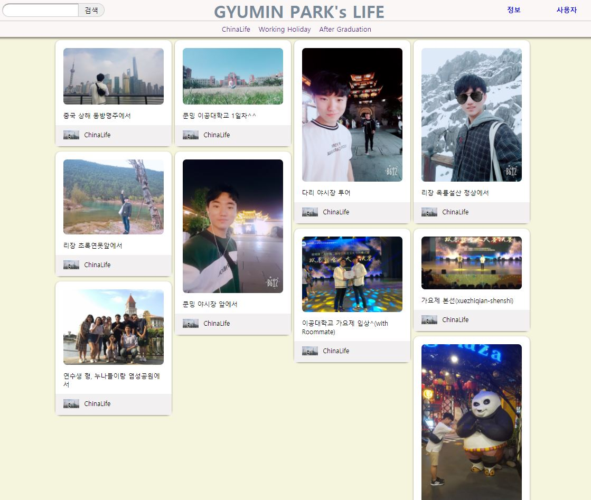

# HTML 학습 리포지토리
========================================
HTML5 CSS, JS 학습용 리포지토리

---------------------------------
## HTML5 
HTML 기본 학습  
[HTML](https://github.com/guemin96/StudyHtml/tree/main/01_HTML)

----------
## CSS3
CSS 기본 학습  
[CSS](https://github.com/guemin96/StudyHtml/tree/main/02_CSS)

-----------------------------------
## Javascript
Javascript 기본 학습  
[JS](https://github.com/guemin96/StudyHtml/tree/main/03_Javascript)

-----------------------------------

## Project
전체 통합 프로그램  
[Project](https://github.com/guemin96/StudyHtml/blob/main/ref_image/Main%20%ED%8E%98%EC%9D%B4%EC%A7%80.JPGl)

#### 반응형 웹 그리드 레이아웃 웹페이지 실습

 

-----------------------------------

## Github Markdown
마크다운 기능 정리

- [바로가기](https://github.com/guemin96/Prac-)
